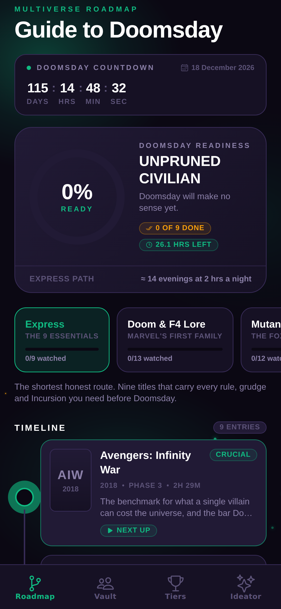
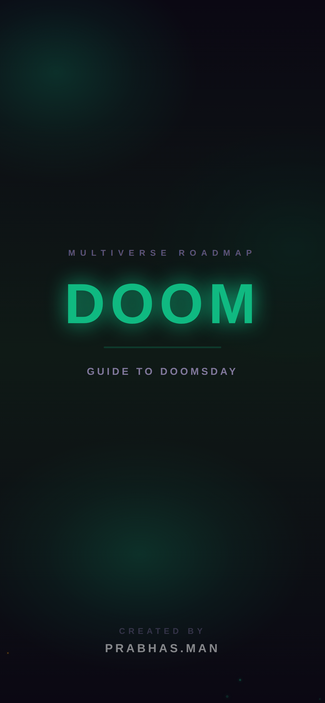
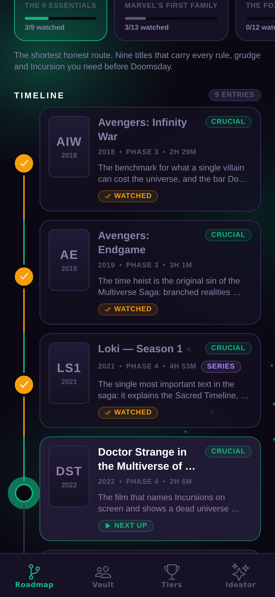
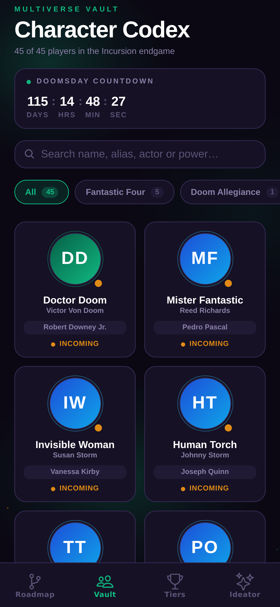
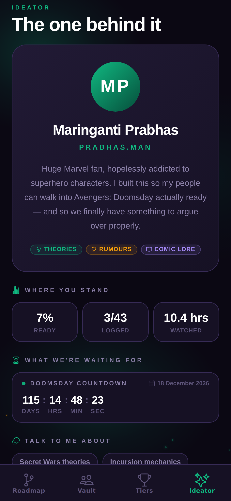
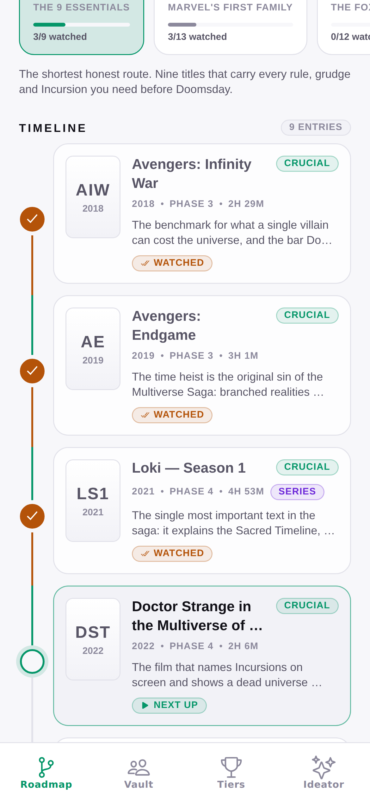
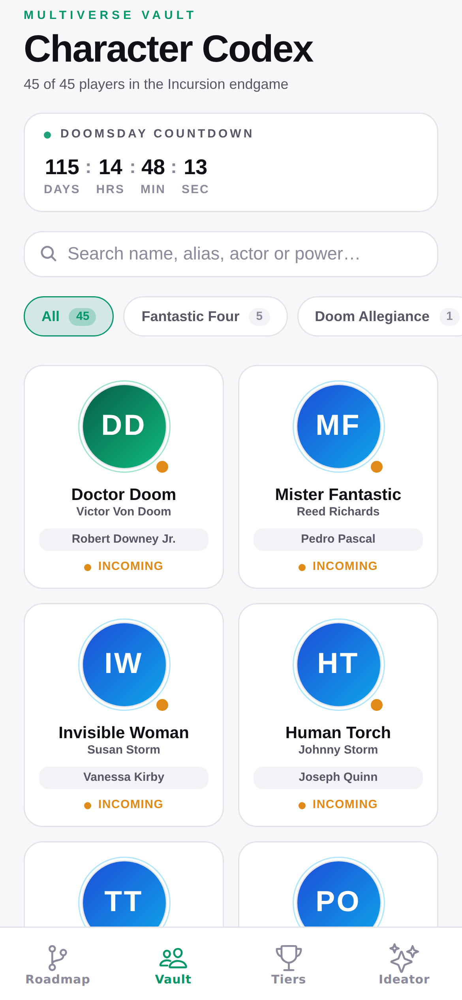
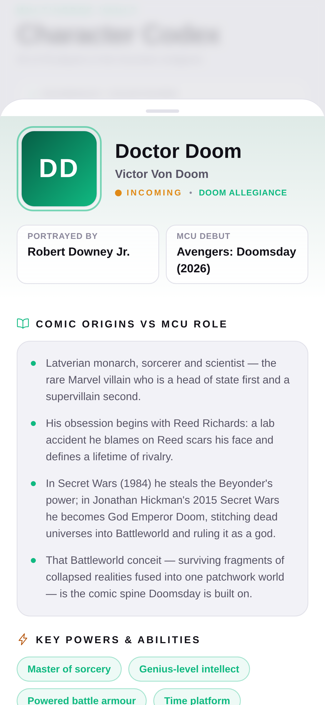
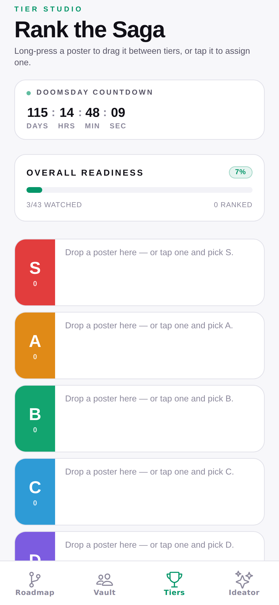

# Multiverse Roadmap: Guide to Doomsday

An offline-first companion app for Marvel fans preparing for *Avengers: Doomsday*.
Pick a watch path, track what you have seen, learn who everyone is, rank the saga
and export a story card of your readiness score.

Built with Expo (managed workflow), TypeScript, Expo Router, NativeWind,
Zustand and Reanimated. No account, no backend, no paid services.

Two themes: a minimal light mode for daylight, and **Doom mode** — smoky green
atmosphere with drifting embers, a live countdown to release, and a DOOM cold
open. Created by **PRABHAS.MAN**.



---

## What's in it

| Tab | What it does |
| --- | --- |
| **Roadmap** | Animated readiness dashboard (circular meter, completion counters, hours remaining), five selectable watch paths, and a vertical connected timeline with tap-to-complete nodes, haptics and a micro particle burst. |
| **Vault** | 45-character codex with live search (name, alias, actor, power), allegiance filter chips with counts, a staggered 2-column grid and a drag-dismissable detail sheet. |
| **Tiers** | S/A/B/C/D board with long-press drag-and-drop between tiers, tap-to-assign, star ratings and a 9:16 branded story-card export. |
| **Ideator** | Who built it and why, your live readiness numbers, what to argue about, the theme switcher and the app's own vitals. |
| **Movie detail** (modal route) | Backdrop, runtime, synopsis, a prominent "Why It Matters for Doomsday" alert box, live "Where to Stream" widget, star rating, tier assigner and key players. |

### Watch paths

| Path | Titles | For |
| --- | --- | --- |
| **Express** | 9 | The shortest honest route to being Doomsday-ready. |
| **Doom & F4 Lore** | 13 | Victor Von Doom, Marvel's First Family and cosmic scale. |
| **Mutants & Incursions** | 12 | The Fox legacy timeline, anchor beings and collisions. |
| **The New Avengers** | 17 | The roster forming right now and the vacuum it fills. |
| **Completionist** | 43 | Everything, in release order. |

---

## Getting started

```bash
cd multiverse-doomsday
npm install
npx expo start
```

Then press `i` (iOS simulator), `a` (Android emulator), `w` (web), or scan the QR
code with Expo Go.

### Optional: TMDB enrichment

The app ships fully functional offline — every title, description and character
is bundled. A free [TMDB v3 key](https://www.themoviedb.org/settings/api) adds
live posters, backdrops, synopses, actor headshots and country-specific
streaming providers (TMDB's JustWatch-powered endpoint).

```bash
cp .env.example .env
# then set:
EXPO_PUBLIC_TMDB_API_KEY=your_key_here
EXPO_PUBLIC_TMDB_REGION=US
```

Without a key nothing errors: posters fall back to typographic cards, portraits
fall back to generated allegiance emblems, and the stream widget explains how to
switch it on.

### Scripts

```bash
npm run typecheck   # tsc --noEmit
npm run lint        # eslint
npm run web         # expo start --web
```

---

## Architecture

```
multiverse-doomsday/
├── app/                        # Expo Router file-based routes
│   ├── (tabs)/
│   │   ├── _layout.tsx         # Tab bar
│   │   ├── index.tsx           # Roadmap / timeline
│   │   ├── characters.tsx      # Character vault
│   │   ├── tierlist.tsx        # Tier studio + share export
│   │   └── ideator.tsx         # About the builder + appearance
│   ├── movie/[id].tsx          # Movie detail (modal presentation)
│   └── _layout.tsx             # Root stack, gesture root, safe areas
├── src/
│   ├── components/
│   │   ├── common/             # Badge, ProgressBar, CustomButton, SearchBar,
│   │   │                       # StarRating, Poster, Confetti, BottomSheet,
│   │   │                       # DoomIntro, DoomAtmosphere, CountdownBar
│   │   ├── roadmap/            # TimelineNode, PathSelector, ReadinessCard, StreamWidget
│   │   ├── characters/         # CharacterCard, CharacterDetailModal, FilterChips, CharacterAvatar
│   │   └── tierlist/           # TierRow, DraggableItem, ShareCard
│   ├── data/                   # movies.json (43), characters.json (45)
│   ├── hooks/                  # useRoadmapStore, useCharacters, useTMDB, useTheme
│   ├── services/               # tmdbApi.ts
│   ├── styles/                 # nativewindInterop.ts
│   ├── types/                  # index.ts — all domain models
│   └── utils/                  # timeCalc.ts, imageHelper.ts, countdown.ts
├── global.css                  # Light + dark token palettes
└── tailwind.config.js          # Semantic colours bound to those tokens
```

### State

`useRoadmapStore` is a Zustand store persisted to AsyncStorage. It holds only
what the user owns — watched flags, ratings, tiers, the active path — keyed by
movie id. The bundled catalogue stays immutable and the two are merged by
`hydrateMovie()` at read time, so shipping new titles never migrates user data.

Selectors (`usePathMovies`, `useReadiness`, `useTierBoard`, `useFavouriteMovie`)
live next to the store, so screens never reach into raw state.

### TMDB layer

`src/services/tmdbApi.ts` handles details, watch providers and actor lookups with:

- a 7-day AsyncStorage cache plus an in-memory tier,
- in-flight request de-duplication (20 posters mounting at once = one request each),
- a 12-second abort timeout,
- `null` on every failure path, so the UI degrades instead of throwing.

### Design tokens and theming

`global.css` declares one set of semantic tokens twice — once for light, once
under `.dark:root` — and `tailwind.config.js` binds them to utility classes.
Components name a role, never a colour:

| Token | Light | Doom mode |
| --- | --- | --- |
| `canvas` | `#F7F7FA` | `#0B0813` |
| `surface` / `surface-raised` | `#FFFFFF` / `#F2F2F7` | `#161124` / `#211A35` |
| `line` | `#E2E2EA` | `#372B56` |
| `ink` / `ink-soft` / `ink-faint` | `#111017` / `#585566` / `#8C899C` | `#FFFFFF` / `#8B80A8` / `#5C5378` |
| `accent` | `#059669` | `#10B981` |
| `gold` / `crimson` / `violet` | `#B45309` / `#DC2626` / `#6D28D9` | `#F59E0B` / `#EF4444` / `#A78BFA` |

`useThemeStore` persists the choice (System / Light / Doom) and `usePalette()`
serves the same values imperatively where `className` cannot reach — SVG strokes,
gradient stops, icon tints, the tab bar and the status bar.

### Doom mode atmosphere

`DoomAtmosphere` renders three slow-breathing radial smoke blooms and a set of
embers drifting upward on staggered loops, all on the UI thread via Reanimated.
It returns `null` in light mode, so the clean theme stays clean. `DoomIntro`
plays the DOOM cold open once per launch and signs off with the creator credit.

---

## Implementation notes

- **`comicBio` is `string[]`.** The spec typed it as `string` but described it as
  "3–4 bullet points", so it is modelled as an array and rendered as a bullet list.
- **`avatarUrl` ships empty by design.** Portraits resolve in this order: a curated
  `avatarUrl`, then a TMDB actor headshot when a key is present, then a generated
  allegiance-gradient emblem with the character's initials. Dropping in CDN URLs is
  a one-field change per character if you want fixed art.
- **`keyCharacterIds`** was added to the movie model so the detail screen can show
  key players without scanning every character.
- **Web output is SPA (`"output": "single"`).** Static rendering runs routes through
  Node, where a native-only dependency fails to interop; the app itself is
  native-first and bundles cleanly for iOS, Android and web.
- **TMDB ids self-heal.** The bundled ids are curated by hand, so
  `resolveTmdbId()` verifies each one's title and release year against TMDB and
  falls back to a title search when they disagree, caching the corrected id. A
  wrong or stale id costs one extra request, once, and then loads the right
  artwork — no data edit required.
- **Themes are one set of tokens, not two sets of classes.** Every colour
  resolves through a CSS variable declared in `global.css`, so a component says
  `bg-surface text-ink` once and the light and dark palettes swap underneath it.
  `usePalette()` serves the same values imperatively for SVG, gradients and icon
  tints. There is not a single `dark:` variant in the codebase.
- **`LinearGradient` ignores `className` when `style` is also passed.** The
  explicit `style` prop wins, so layout for a gradient goes in `style`.
- **NativeWind needs Reanimated and Moti registered.** `className` is only wired
  into React Native's core components, so `src/styles/nativewindInterop.ts`
  registers `Animated.*` and `Moti*` via `cssInterop`. Without it every
  `className` on an animated component is silently dropped.

## Screenshots

**Doom mode** — green smoke, drifting embers, neon wordmark.

| Cold open | Roadmap | Vault | Ideator |
| --- | --- | --- | --- |
|  |  |  |  |

**Light mode** — minimal, professional, built for daylight reading.

| Roadmap | Vault | Character | Tiers |
| --- | --- | --- | --- |
|  |  |  |  |

Captured from the running app at 390×844 @3x. Posters show their offline
fallbacks — add a TMDB key for live artwork.

## Verified

`tsc --noEmit` clean · `eslint` clean · `expo export` succeeds for web, iOS and
Android · every screen rendered and driven end-to-end in a real browser with no
console errors.
